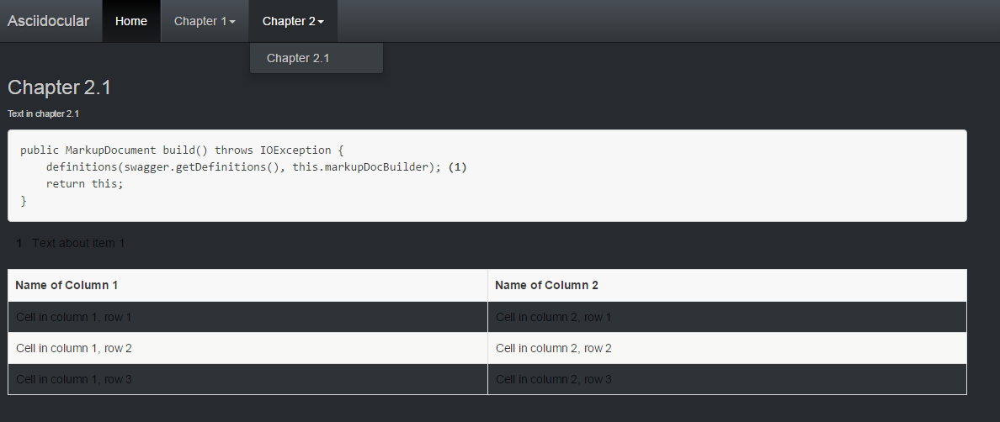

= Asciidocular

NOTE: It is currently under development.

Asciidocular is a small AngularJS web app that loads http://asciidoctor.org/[AsciiDoctor] files via Ajax and renders them as a full page.
Asciidocular uses https://github.com/asciidoctor/asciidoctor.js[asciidoctor.js] to convert the AsciiDoc files into HTML.

* No server-side components needed
* No build process needed
* Deployable via GitHub Pages
* Responsive Bootswatch Slate (Bootstrap) theme
* Just create an Asciidoctor files and deploy!

The title of the web app is the document title.
Each level 1 section title is a navigation item and each level 2 section title is a sub navigation item of the navigation bar.

