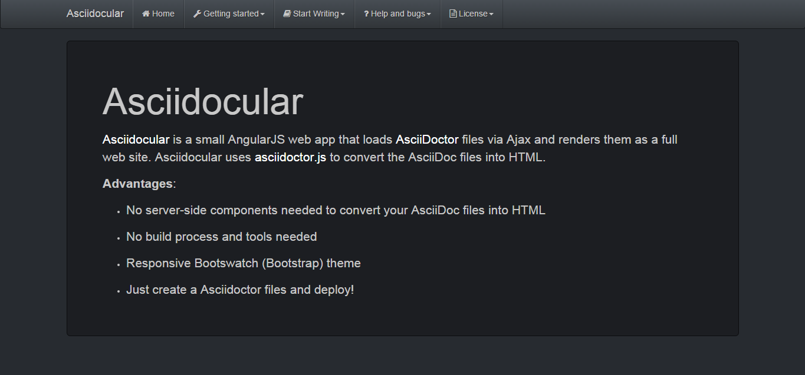
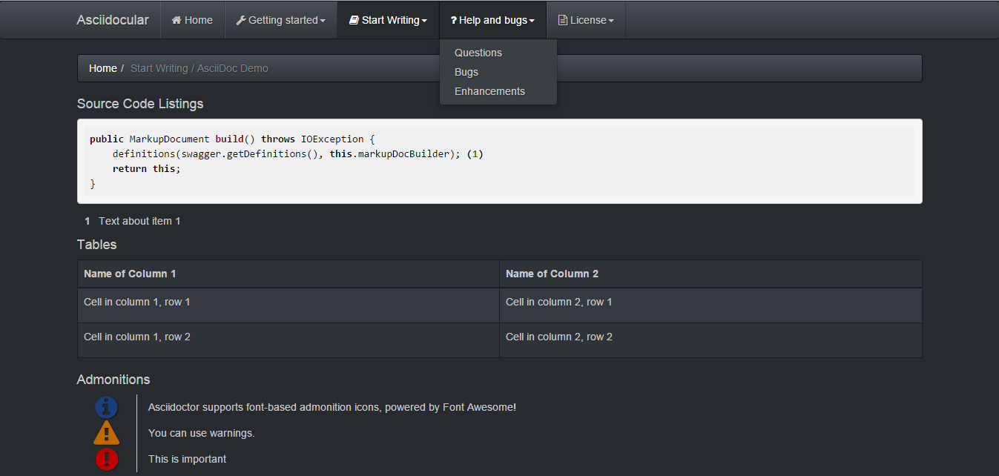

= Asciidocular
:icons: font
:hardbreaks:

image:https://travis-ci.org/RobWin/asciidocular.svg?branch=master["Build Status", link="https://travis-ci.org/RobWin/asciidocular"]

NOTE: Currently highly under development.

Asciidocular is a small AngularJS web app that loads http://asciidoctor.org/[AsciiDoctor] files via Ajax and renders them as a full web site. Asciidocular uses https://github.com/asciidoctor/asciidoctor.js[asciidoctor.js] to convert the AsciiDoc files into HTML.

Asciidocular can be used to create a documentation site of your project or API. For example, you could use Asciidocular together with https://github.com/Swagger2Markup/swagger2markup[Swagger2Markup] to create a documentation site of your http://swagger.io[Swagger] API.

Since AsciiDoc syntax is just plain text, you can write an AsciiDoc document using any text editor.

Advantages:

* No build process and server-side tools needed to convert your AsciiDoc files into HTML
* Responsive Bootswatch (Bootstrap) theme
* Deployable via GitHub Pages
* Just create AsciiDoc files and deploy!

Features:

* Supports highlight.js
* Supports Font-Awesome

== Demo

http://robwin.github.io/asciidocular[Live Demo] deployed on GitHub Pages.

== Usage Guide

=== Building from source

Make sure you have http://nodejs.org/[Node.js] installed.

----
git clone https://github.com/RobWin/asciidocular.git
cd asciidocular
npm run build
----

=== Create AsciiDoc files

You have to create an `index.adoc` file in the `docs` folder of the app.

----
= Asciidocular //<1>
Robert Winkler
:icons: font

This is a preamble. <2>

== Chapter 1 //<3>

=== Chapter 1.1 //<4>

Text in chapter 1.1

* Item 1
* Item 2

NOTE: Asciidoctor supports font-based admonition icons, powered by Font Awesome!

include::chapter2.adoc[] //<5>
----

<1> The document title is the title of the web site.
<2> The preamble of the document is the content of the jumbotron.
<3> Each level 1 section title is a top-level navigation item
<4> Each level 2 section title is a sub navigation item of the parent section in the navigation bar.
<5> You can include other AsciiDoc files into the `index.adoc` file.

== Examples

=== Asciidocular on Mobile Phone
image::images/asciidocular_mobile.png[]

=== Asciidocular on Tablet
==== Home

==== Sections

== Questions
You can ask questions about Asciidocular in https://gitter.im/Swagger2Markup/swagger2markup[Gitter].

== Bugs
If you believe you have found a bug, please take a moment to search the existing issues. If no one else has reported the problem, please open a new issue that describes the problem in detail and, ideally, includes a test that reproduces it.

== Enhancements
If you’d like an enhancement to be made to Asciidocular, pull requests are most welcome. The source code is on GitHub. You may want to search the existing issues and pull requests to see if the enhancement is already being worked on. You may also want to open a new issue to discuss a possible enhancement before work on it begins.

== License

Copyright 2015 Robert Winkler

Licensed under the Apache License, Version 2.0 (the "License"); you may not use this file except in compliance with the License. You may obtain a copy of the License at

    http://www.apache.org/licenses/LICENSE-2.0

Unless required by applicable law or agreed to in writing, software distributed under the License is distributed on an "AS IS" BASIS, WITHOUT WARRANTIES OR CONDITIONS OF ANY KIND, either express or implied. See the License for the specific language governing permissions and limitations under the License.
